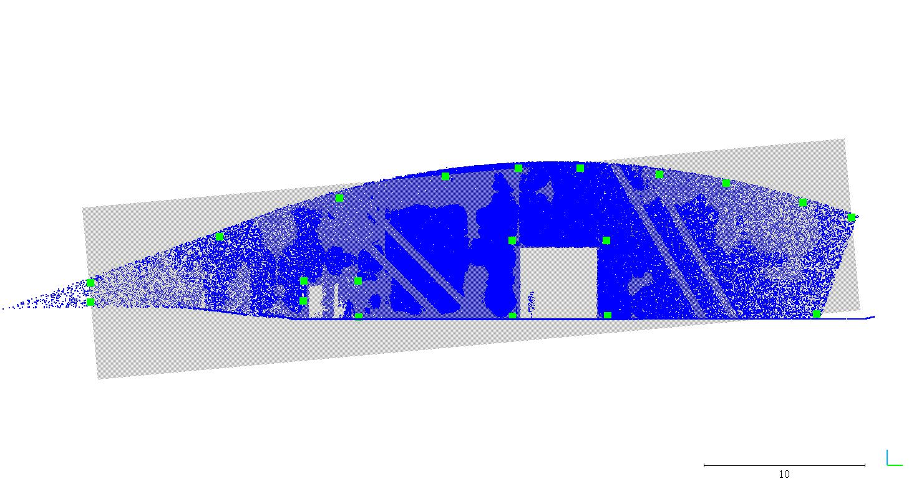
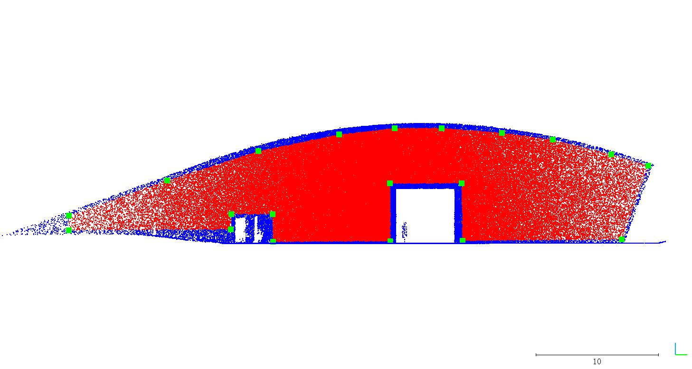
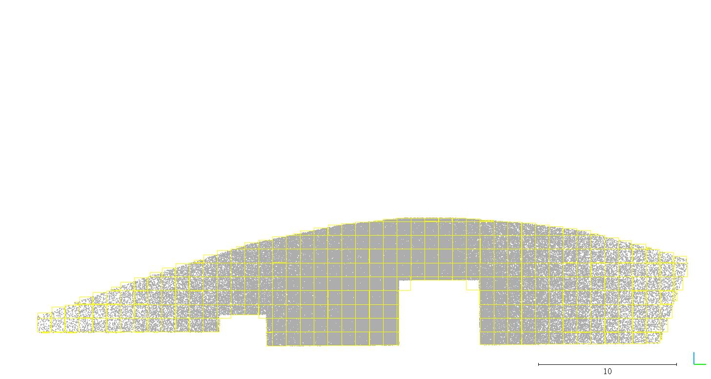
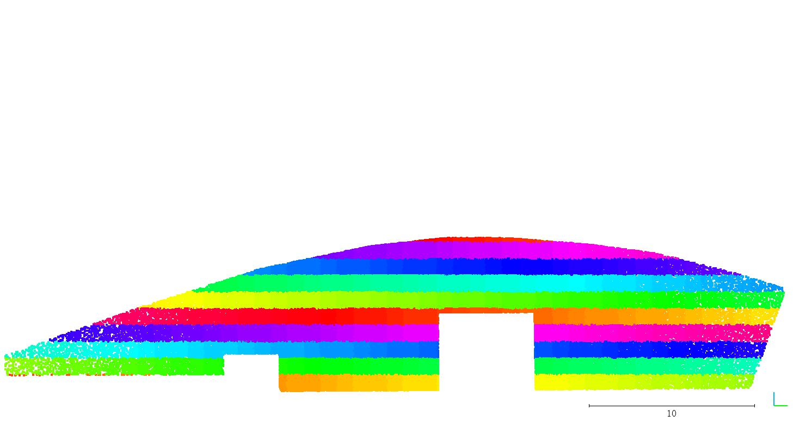

# gseg_pcd_tools

## simple point cloud processing tools 

 - [x] gseg_pcdcut: Cut a point cloud defined by a projected bounding polygon

 - [x] gesg_pcd2grid: Split a point cloud into several grid point clouds according to a file defining the grids

 - [] more to do
____________________________________________________________________________________

____________________________________________________________________________________

### How to use

1. Install dependent libraries

Compulsory:

- [PCL(>=1.7)](https://github.com/PointCloudLibrary/pcl)

Optional:

- For *.las data IO: [LibLas](https://github.com/libLAS/libLAS)

If you are on ubuntu 14.04/16.04/18.04, you can simply use the apt to install pcl 1.7, as follows:

```
echo "install [pcl] 1.7"
echo "eigen, boost, flann, vtk involved in pcl"
sudo apt-get install libpcl-dev pcl-tools libproj-dev
echo "install [pcl] done"
```

2. Compile
```
mkdir build
cd build
cmake ..
make -j4
```

3. Run
```
cd ..
# configure the data path in script/run.sh file 
# the example datas are inside the test_data folder
# run the function
sh script/run_xxx.sh
```

### File format specification

1. plane coefficients file

for a plane ( ax + by + cz + d =0 )

```
a b c d
```

Only one line, split with space

2. bounding polygon file

for a polygon ABCD...

```
X_A Y_A Z_A
X_B Y_B Z_B
X_C Y_C Z_C
X_D Y_D Z_D
... ... ...
```

Line number equals to the number of vertex, the vertices' order is clockwise or anti-clockwise. Each line contains the x,y,z coordinate of the vertex, split with space

3. grid definition file

```
ID x_bl y_bl z_bl x_tl y_tl z_tl x_tr y_tr z_tr x_br y_br z_br

1 ... ... ...
2 ... ... ...
...

```

The first line is a commented line used for describing the data format. The other lines each contains the ID, x,y,z coordinates of the bottom left, top left, top right and bottom right (clockwise) corner of the corresponding grid, split by space

### Example Results

By using the test shell files in ```script``` and the example data in ```test_data```, you are supposed to reproduce the following results.

1. gseg_pcdcut


input point cloud (blue), input bounding polygon (green), input reference plane coefficients (gray)



output the point cloud after cutting (red)


2. gseg_pcd2grid


input point cloud (gray), input grid definition file (yellow)



output point clouds in grids (each grid has its own color)

#### [Link](https://gseg.igp.ethz.ch/)